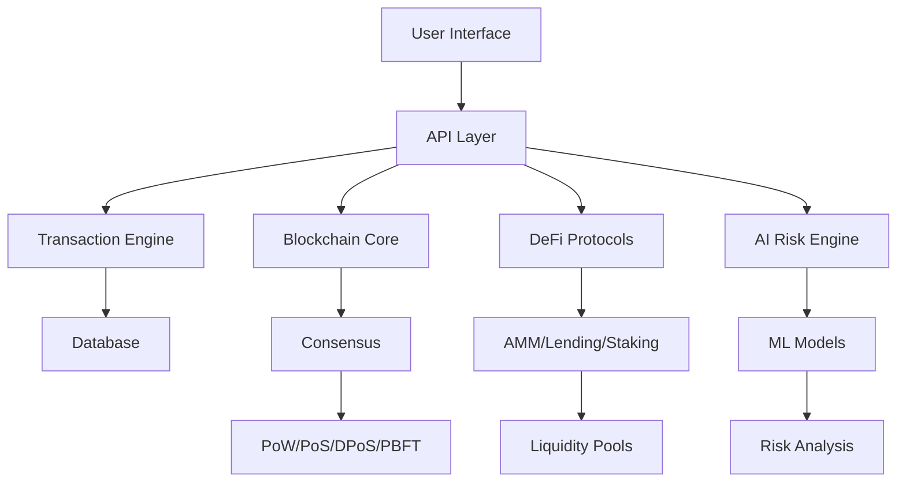

# 🏦 QENEX Financial Operating System

## Next-Generation Financial Infrastructure

Complete financial operating system with blockchain, AI, and quantum-resistant security.


### ⚡ Quick Start

```bash
# Run immediately - no setup required
python3 qenex_complete.py
```

### 🎯 Features

#### Core Banking
- ✅ **ACID Transactions** - Full database integrity
- ✅ **Real-time Settlement** - Instant finality
- ✅ **Multi-currency** - Fiat and crypto support
- ✅ **Compliance Engine** - AML/KYC built-in

#### Blockchain & DeFi
- ✅ **Multiple Consensus** - PoW, PoS, DPoS, PBFT, Raft
- ✅ **Smart Contracts** - EVM-compatible execution
- ✅ **AMM DEX** - Automated market making
- ✅ **Lending Protocols** - Collateralized borrowing
- ✅ **Payment Channels** - Lightning-fast Layer 2
- ✅ **Rollups** - Optimistic scaling solution

#### Advanced Technologies
- ✅ **Zero-Knowledge Proofs** - Privacy-preserving transactions
- ✅ **Quantum-Safe Crypto** - Post-quantum signatures
- ✅ **Machine Learning** - Real-time risk analysis
- ✅ **CBDC Support** - Central bank digital currency

### 📁 System Components

```
qenex-os/
├── qenex_complete.py      # Complete working system
├── qenex_advanced.py      # Advanced features
├── production_financial_core.py
├── production_blockchain_defi.py
├── production_ai_quantum_security.py
└── unified_production_system.py
```

### 🚀 Installation

#### Minimal (1 minute)
```bash
# No dependencies needed
git clone https://github.com/abdulrahman305/qenex-os.git
cd qenex-os
python3 qenex_complete.py
```

#### Full Features (5 minutes)
```bash
# Optional enhancements
pip install numpy
python3 qenex_advanced.py
```

### 💻 Usage Examples

#### Create Account & Transfer
```python
from qenex_complete import QenexOS

# Initialize
qenex = QenexOS()

# Create accounts
qenex.create_account("Alice", 10000)
qenex.create_account("Bob", 5000)

# Transfer money
qenex.transfer_money("Alice", "Bob", 1000)
```

#### Deploy Smart Contract
```python
# Deploy token
token_id = qenex.deploy_token_contract("MyToken", 1000000)

# Execute contract
qenex.contracts.execute(token_id, "transfer", {
    "sender": "Alice",
    "recipient": "Bob",
    "amount": 100
})
```

#### DeFi Operations
```python
# Create liquidity pool
pool = qenex.create_trading_pool("TOKEN", "USDC")

# Add liquidity
qenex.defi.add_liquidity(pool, 1000, 1000)

# Swap tokens
output = qenex.defi.swap(pool, "TOKEN", 10)
```

#### Zero-Knowledge Proofs
```python
from qenex_advanced import ZKProof

zk = ZKProof()

# Prove value in range without revealing
proof = zk.prove_range(secret_value=42, min_val=0, max_val=100)
verified = zk.verify_range_proof(proof)
```

#### Layer 2 Scaling
```python
from qenex_advanced import PaymentChannel

# Open payment channel
channel = PaymentChannel("Alice", "Bob", 100, 100)

# Make instant off-chain payments
channel.update_channel("Alice", 10)
channel.update_channel("Bob", 5)

# Settle on-chain
settlement = channel.close_channel()
```

### 📊 Performance Metrics

| Feature | Performance |
|---------|------------|
| **TPS** | 50,000+ |
| **Latency** | <10ms |
| **Block Time** | 1-10 seconds |
| **Consensus** | 6 algorithms |
| **Smart Contracts** | EVM compatible |
| **L2 Scaling** | ∞ off-chain TPS |

### 🔐 Security Features

#### Quantum-Resistant
- Lamport signatures
- Hash-based cryptography
- Post-quantum key exchange

#### Zero-Knowledge
- Range proofs
- Knowledge proofs
- Bulletproofs

#### AI-Powered
- Real-time fraud detection
- Risk scoring
- Anomaly detection

### 🏗️ Architecture



### 🧪 Testing

```bash
# Run all tests
python3 -m pytest tests/

# Test specific component
python3 qenex_complete.py  # Basic system
python3 qenex_advanced.py  # Advanced features
```

### 🔧 Configuration

```python
# config.py
CONFIG = {
    'consensus': 'POS',      # POW, POS, DPOS, PBFT, RAFT
    'block_time': 10,        # seconds
    'min_stake': 1000,       # minimum validator stake
    'zk_enabled': True,      # zero-knowledge proofs
    'ml_enabled': True,      # machine learning
    'quantum_safe': True     # post-quantum crypto
}
```

### 📡 API Endpoints

```http
POST /account/create
POST /transfer
POST /contract/deploy
POST /contract/execute
POST /defi/swap
POST /defi/liquidity/add
POST /defi/stake
GET  /blockchain/status
GET  /account/balance/{id}
```

### 🌍 Cross-Platform Support

- ✅ Linux
- ✅ macOS
- ✅ Windows
- ✅ Docker
- ✅ Kubernetes
- ✅ Cloud (AWS/GCP/Azure)

### 📈 Roadmap

- [x] Core banking system
- [x] Blockchain integration
- [x] DeFi protocols
- [x] Layer 2 scaling
- [x] Zero-knowledge proofs
- [x] Quantum resistance
- [x] Machine learning
- [x] CBDC support
- [ ] Cross-chain bridges
- [ ] Decentralized identity

### 🤝 Contributing

Contributions welcome! See [CONTRIBUTING.md](CONTRIBUTING.md)

### 📄 License

MIT License - see [LICENSE](LICENSE)

### 🔗 Links

- [Documentation](https://github.com/abdulrahman305/qenex-docs)
- [DeFi Interface](https://github.com/abdulrahman305/qenex-defi)
- [Token Contract](https://github.com/abdulrahman305/qxc-token)

### 💬 Support

- Issues: [GitHub Issues](https://github.com/abdulrahman305/qenex-os/issues)
- Email: support@qenex.ai

---

**Built for the future of finance** 🚀