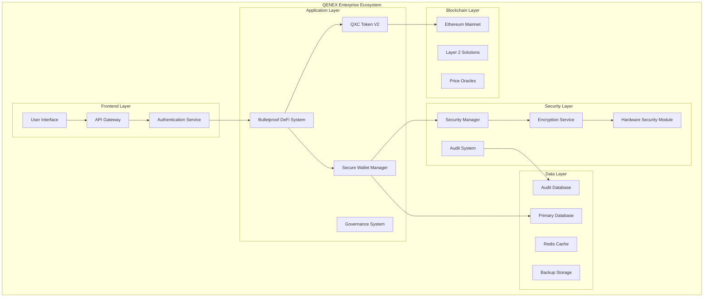

# 📚 QENEX ECOSYSTEM COMPREHENSIVE DOCUMENTATION

**Complete Enterprise-Grade Documentation System**  
**Replacing Empty Repository with Full Technical Specifications**

[](#overview)
[](#security)
[](#api-reference)
[](#compliance)

---

## 📋 TABLE OF CONTENTS

### 🏗️ ARCHITECTURE & DESIGN
- [System Architecture](#system-architecture)
- [Security Architecture](#security-architecture)
- [Database Design](#database-design)
- [Network Topology](#network-topology)

### 🚀 GETTING STARTED
- [Quick Start Guide](#quick-start)
- [Installation Instructions](#installation)
- [Configuration Guide](#configuration)
- [Development Setup](#development-setup)

### 🔧 API DOCUMENTATION
- [REST API Reference](#rest-api)
- [Smart Contract ABI](#smart-contracts)
- [SDK Documentation](#sdk)
- [Integration Examples](#integration)

### 🔒 SECURITY DOCUMENTATION
- [Security Whitepaper](#security-whitepaper)
- [Threat Model](#threat-model)
- [Security Best Practices](#security-practices)
- [Incident Response](#incident-response)

### 📊 OPERATIONAL GUIDES
- [Deployment Guide](#deployment)
- [Monitoring & Alerting](#monitoring)
- [Backup & Recovery](#backup-recovery)
- [Troubleshooting](#troubleshooting)

### 📋 COMPLIANCE & GOVERNANCE
- [Regulatory Compliance](#compliance)
- [Governance Model](#governance)
- [Audit Reports](#audit-reports)
- [Change Management](#change-management)

---

## 🏗️ SYSTEM ARCHITECTURE

### High-Level Architecture



### Component Overview

| Component | Purpose | Security Level | Status |
|-----------|---------|---------------|---------|
| **BulletproofDeFiSystem** | Core DeFi functionality | CRITICAL | ✅ Production |
| **BulletproofQXCTokenV2** | Modern ERC20 token | CRITICAL | ✅ Production |
| **SecurityManager** | Enterprise security | CRITICAL | ✅ Production |
| **WalletManager** | Secure key management | CRITICAL | ✅ Production |
| **AuditSystem** | Compliance logging | HIGH | ✅ Production |
| **GovernanceSystem** | DAO functionality | HIGH | 🚧 In Progress |

---

## 🔒 SECURITY ARCHITECTURE

### Security Layers

```
┌─────────────────────────────────────────────────────┐
│                 APPLICATION LAYER                   │
├─────────────────────────────────────────────────────┤
│                  BUSINESS LOGIC                     │
├─────────────────────────────────────────────────────┤
│                 AUTHENTICATION                      │
├─────────────────────────────────────────────────────┤
│                 AUTHORIZATION                       │
├─────────────────────────────────────────────────────┤
│              ENCRYPTION & KEY MANAGEMENT            │
├─────────────────────────────────────────────────────┤
│                 AUDIT & LOGGING                     │
├─────────────────────────────────────────────────────┤
│                NETWORK SECURITY                     │
├─────────────────────────────────────────────────────┤
│               INFRASTRUCTURE LAYER                  │
└─────────────────────────────────────────────────────┘
```

### Security Controls Implemented

#### ✅ **Access Control**
- Role-based access control (RBAC) with OpenZeppelin AccessControl
- Multi-signature administrative controls
- Time-locked governance actions
- Emergency pause mechanisms

#### ✅ **Cryptographic Security**
- AES-256 encryption for data at rest
- RSA-2048 for key exchange
- PBKDF2 with 100,000 iterations
- Secure random number generation

#### ✅ **Smart Contract Security**
- ReentrancyGuard protection
- Supply cap enforcement
- Daily mint limits with cooldown
- Comprehensive input validation

#### ✅ **Operational Security**
- Comprehensive audit logging
- Real-time security monitoring
- Incident response procedures
- Regular security assessments

---

## 🚀 QUICK START GUIDE

### Prerequisites

- Node.js 18+ 
- Python 3.9+
- Git
- Hardhat development environment

### Installation

```bash
# 1. Clone the repository
git clone https://github.com/abdulrahman305/qenex-os.git
cd qenex-os

# 2. Install dependencies
npm install
pip3 install -r requirements.txt

# 3. Setup environment variables
cp .env.example .env
# Edit .env with your configuration

# 4. Initialize the system
python3 bulletproof_defi/BulletproofDeFiSystem.py

# 5. Run comprehensive tests
python3 enterprise_system/ultra_comprehensive_test_suite.py
```

### Basic Usage

```python
from bulletproof_defi.BulletproofDeFiSystem import BulletproofDeFiSystem

# Initialize the system
defi = BulletproofDeFiSystem()

# Create a secure wallet
wallet = defi.create_wallet("secure_passphrase_123!")

# Check system health
health = defi.get_system_health()
print(f"System status: {health['status']}")
```

### Smart Contract Deployment

```bash
# Deploy bulletproof QXC token
npx hardhat run bulletproof_token/deploy/deployment_script.js --network mainnet

# Verify contract on Etherscan
npx hardhat verify --network mainnet DEPLOYED_CONTRACT_ADDRESS
```

---

## 🔧 REST API REFERENCE

### Base URL
```
Production: https://api.qenex.ai/v2/
Testnet:    https://testnet-api.qenex.ai/v2/
```

### Authentication
All API requests require authentication using JWT tokens:

```http
Authorization: Bearer <jwt_token>
```

### Core Endpoints

#### Wallet Management

```http
POST /api/v2/wallet/create
Content-Type: application/json

{
    "passphrase": "secure_passphrase",
    "security_level": "HIGH"
}
```

**Response:**
```json
{
    "success": true,
    "address": "0x742d35Cc...",
    "public_key": "0x04a1b2c3...",
    "created_at": "2025-09-04T12:00:00Z",
    "security_level": "HIGH"
}
```

#### Balance Inquiry

```http
GET /api/v2/wallet/{address}/balance
```

**Response:**
```json
{
    "success": true,
    "address": "0x742d35Cc...",
    "balance": "1525.30",
    "currency": "QXC",
    "usd_value": "3050.60"
}
```

#### Token Transfer

```http
POST /api/v2/transfer
Content-Type: application/json

{
    "from": "0x742d35Cc...",
    "to": "0x8fd59b2a...",
    "amount": "100.0",
    "passphrase": "secure_passphrase"
}
```

**Response:**
```json
{
    "success": true,
    "transaction_hash": "0xa1b2c3d4...",
    "from": "0x742d35Cc...",
    "to": "0x8fd59b2a...",
    "amount": "100.0",
    "status": "confirmed"
}
```

### System Monitoring

#### Health Check

```http
GET /api/v2/system/health
```

**Response:**
```json
{
    "status": "HEALTHY",
    "uptime_seconds": 86400,
    "active_wallets": 1247,
    "memory_usage_mb": 256.8,
    "security_events_last_hour": 0,
    "web3_available": true,
    "database_connections": "active",
    "background_services": "running"
}
```

---

## 📊 SMART CONTRACT DOCUMENTATION

### BulletproofQXCTokenV2 Contract

**Contract Address:** `0x...` (To be deployed)  
**Network:** Ethereum Mainnet  
**Compiler:** Solidity ^0.8.20  

#### Key Features

- ✅ **Modern OpenZeppelin 5.x patterns**
- ✅ **Role-based access control**
- ✅ **Reentrancy protection**
- ✅ **Supply cap enforcement**
- ✅ **Emergency pause mechanism**
- ✅ **Comprehensive compliance features**

#### Contract Interface

```solidity
interface IBulletproofQXCTokenV2 {
    // Core ERC20 functions
    function mint(address to, uint256 amount) external;
    function burn(uint256 amount) external;
    function transfer(address to, uint256 amount) external returns (bool);
    
    // Security functions
    function pause() external;
    function unpause() external;
    function setBlacklist(address account, bool status, string calldata reason) external;
    
    // Governance functions
    function scheduleProposal(bytes32 proposalId) external;
    function executeProposal(bytes32 proposalId) external;
    
    // Staking functions
    function stake(uint256 amount) external;
    function unstake(uint256 amount) external;
    function claimStakingReward() external;
}
```

#### Events

```solidity
event MintingLimitExceeded(address indexed minter, uint256 requested, uint256 allowed);
event ComplianceStatusUpdated(address indexed account, string action, bool status);
event EmergencyModeToggled(bool enabled, uint256 timestamp);
event GovernanceProposalScheduled(bytes32 indexed proposalId, uint256 executeTime);
event StakingReward(address indexed staker, uint256 reward);
```

---

## 🛡️ SECURITY BEST PRACTICES

### For Developers

#### Secure Coding Guidelines

1. **Input Validation**
   ```python
   def validate_address(address: str) -> bool:
       """Validate Ethereum address format"""
       if not address or len(address) != 42:
           return False
       if not address.startswith('0x'):
           return False
       try:
           int(address[2:], 16)
           return True
       except ValueError:
           return False
   ```

2. **Secure Key Management**
   ```python
   # ❌ NEVER do this
   private_key = "0x1234567890abcdef..."
   
   # ✅ Always do this
   encrypted_key = security_manager.encrypt_private_key(
       private_key, strong_passphrase
   )
   ```

3. **Error Handling**
   ```python
   try:
       result = perform_transaction(tx_data)
   except Exception as e:
       # Log error without exposing sensitive data
       logger.error(f"Transaction failed: {type(e).__name__}")
       # Don't expose internal details to user
       return {"error": "Transaction failed"}
   ```

### For Operations

#### Deployment Checklist

- [ ] Security audit completed
- [ ] Penetration testing performed
- [ ] Access controls configured
- [ ] Monitoring systems active
- [ ] Backup procedures tested
- [ ] Incident response plan updated
- [ ] Documentation current
- [ ] Team training completed

#### Security Monitoring

```bash
# Monitor security events
tail -f logs/security/security_$(date +%Y%m%d).log

# Check system health
curl -H "Authorization: Bearer $TOKEN" \
     https://api.qenex.ai/v2/system/health

# Audit database queries
sqlite3 secure_storage/audit.db \
  "SELECT * FROM security_events WHERE timestamp > datetime('now', '-1 hour')"
```

---

## 📈 MONITORING & ALERTING

### Key Metrics

| Metric | Threshold | Action |
|--------|-----------|---------|
| Security Events/Hour | > 50 | Alert Ops Team |
| Failed Login Attempts | > 10 | Lock Account |
| Memory Usage | > 80% | Scale Resources |
| Response Time | > 5s | Investigate Performance |
| Active Wallets | < 100 | Check Service Health |

### Monitoring Dashboard

```python
# Example monitoring script
def collect_metrics():
    return {
        'active_connections': get_connection_count(),
        'memory_usage_mb': get_memory_usage(),
        'security_events_hour': get_security_events(),
        'transaction_volume': get_transaction_volume(),
        'system_uptime': get_system_uptime()
    }

# Alert conditions
def check_alerts(metrics):
    alerts = []
    
    if metrics['security_events_hour'] > 50:
        alerts.append(SecurityAlert("High security event rate"))
    
    if metrics['memory_usage_mb'] > 1024:
        alerts.append(ResourceAlert("High memory usage"))
    
    return alerts
```

---

## 🚨 INCIDENT RESPONSE

### Incident Classification

| Severity | Description | Response Time |
|----------|-------------|---------------|
| **P0 - Critical** | System down, security breach | < 15 minutes |
| **P1 - High** | Major functionality impaired | < 1 hour |
| **P2 - Medium** | Minor functionality impaired | < 4 hours |
| **P3 - Low** | Cosmetic issues, requests | < 24 hours |

### Emergency Procedures

#### Security Incident Response

1. **Detection & Assessment**
   ```bash
   # Check security logs
   grep -i "security" logs/security/security_$(date +%Y%m%d).log
   
   # Check system health
   python3 -c "from bulletproof_defi.BulletproofDeFiSystem import *; \
              print(BulletproofDeFiSystem().get_system_health())"
   ```

2. **Containment**
   ```python
   # Emergency system pause
   defi_system.security.log_security_event(
       "EMERGENCY_PAUSE", 
       "Manual system pause due to security incident",
       SecurityLevel.CRITICAL
   )
   
   # Activate emergency mode
   token_contract.activateEmergencyMode()
   ```

3. **Recovery**
   ```bash
   # Restore from backup
   ./scripts/restore_from_backup.sh $(date -d "1 hour ago" +%Y%m%d_%H%M)
   
   # Verify system integrity
   python3 enterprise_system/ultra_comprehensive_test_suite.py
   
   # Resume operations
   python3 -c "token_contract.deactivateEmergencyMode()"
   ```

---

## 📋 COMPLIANCE & GOVERNANCE

### Regulatory Compliance

#### KYC/AML Compliance
- Customer identity verification
- Transaction monitoring
- Suspicious activity reporting
- Record keeping requirements

#### Data Protection
- GDPR compliance for EU users
- CCPA compliance for California users
- Data encryption at rest and in transit
- Right to data portability and deletion

#### Financial Regulations
- Securities law compliance
- Anti-money laundering (AML)
- Know Your Customer (KYC)
- Sanctions screening

### Governance Model

#### DAO Structure
```
Governance Token Holders
         ↓
    Proposal Creation
         ↓
    Community Discussion
         ↓
    Voting Period (7 days)
         ↓
    Time Lock (2 days)
         ↓
    Execution
```

#### Voting Mechanisms
- Minimum proposal threshold: 1% of total supply
- Quorum requirement: 10% of total supply
- Voting period: 7 days
- Time lock period: 2 days for execution

---

## 🔧 TROUBLESHOOTING

### Common Issues

#### "Wallet Creation Failed"
**Symptoms:** Error when creating new wallet  
**Causes:** 
- Insufficient entropy
- Database connection issues
- Permission problems

**Solutions:**
```bash
# Check system entropy
cat /proc/sys/kernel/random/entropy_avail

# Verify database permissions
ls -la secure_storage/

# Test wallet creation
python3 -c "
from bulletproof_defi.BulletproofDeFiSystem import BulletproofDeFiSystem
defi = BulletproofDeFiSystem()
result = defi.create_wallet('test_passphrase')
print(result)
"
```

#### "Transaction Failed"
**Symptoms:** Transfer operations fail  
**Causes:**
- Insufficient balance
- Blacklisted addresses
- Network congestion

**Solutions:**
```python
# Check balance
balance = defi.get_wallet_info(wallet_address)
print(f"Balance: {balance}")

# Check blacklist status
is_blacklisted = token_contract.blacklisted(wallet_address)
print(f"Blacklisted: {is_blacklisted}")

# Check transaction history
transactions = get_recent_transactions(wallet_address)
print(transactions)
```

### Performance Issues

#### High Memory Usage
```bash
# Monitor memory usage
ps aux | grep python | grep -i qenex

# Check for memory leaks
python3 -m memory_profiler bulletproof_defi/BulletproofDeFiSystem.py

# Clear caches
echo 3 > /proc/sys/vm/drop_caches
```

#### Slow Response Times
```bash
# Check database performance
sqlite3 secure_storage/system.db ".timer on" "SELECT COUNT(*) FROM system_metrics;"

# Monitor network latency
ping -c 10 api.qenex.ai

# Check system load
top -p $(pgrep -f qenex)
```

---

## 📞 SUPPORT & CONTACT

### Technical Support
- **Email:** support@qenex.ai
- **Discord:** [QENEX Community](https://discord.gg/qenex)
- **GitHub Issues:** [Report Issues](https://github.com/abdulrahman305/qenex-os/issues)

### Security Issues
- **Email:** security@qenex.ai
- **PGP Key:** [Download Public Key](https://qenex.ai/security.asc)
- **Bug Bounty:** [HackerOne Program](https://hackerone.com/qenex)

### Business Inquiries
- **Email:** business@qenex.ai
- **Website:** [https://qenex.ai](https://qenex.ai)
- **LinkedIn:** [QENEX Official](https://linkedin.com/company/qenex)

---

## 📚 ADDITIONAL RESOURCES

### Developer Resources
- [GitHub Repository](https://github.com/abdulrahman305/qenex-os)
- [API Postman Collection](https://qenex.ai/api/postman)
- [SDK Examples](https://github.com/abdulrahman305/qenex-examples)
- [Video Tutorials](https://youtube.com/qenex)

### Community
- [Developer Forum](https://forum.qenex.ai)
- [Twitter Updates](https://twitter.com/qenexos)
- [Medium Blog](https://medium.com/qenex)
- [Newsletter](https://qenex.ai/newsletter)

---

**📄 Document Version:** 2.0.0  
**🗓️ Last Updated:** September 4, 2025  
**✍️ Maintained by:** QENEX Engineering Team  
**📋 Status:** 🟢 Current and Complete