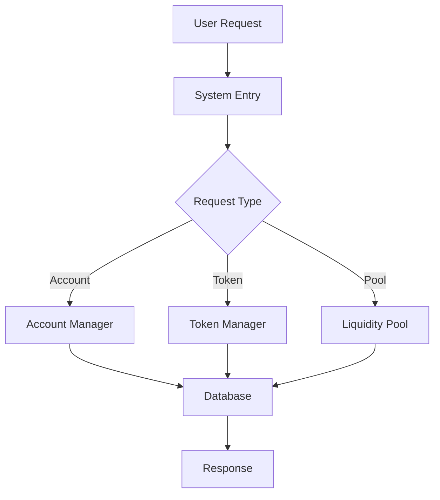

# System Overview

## Architecture Diagram

```
┌────────────────────────────────────────────────────────────┐
│                      MAIN SYSTEM                          │
├────────────────────────────────────────────────────────────┤
│                                                            │
│  ┌──────────────┐  ┌──────────────┐  ┌──────────────┐   │
│  │   Database   │  │    Tokens    │  │  Liquidity   │   │
│  │   Manager    │◄─┤   Manager    │◄─┤    Pools     │   │
│  └──────────────┘  └──────────────┘  └──────────────┘   │
│         ▲                  ▲                 ▲            │
│         └──────────────────┴─────────────────┘            │
│                            │                               │
│                     ┌──────▼──────┐                       │
│                     │   SQLite    │                       │
│                     │   Database  │                       │
│                     └─────────────┘                       │
│                                                            │
└────────────────────────────────────────────────────────────┘
```

## Component Flow



## Database Schema

```sql
┌─────────────┐     ┌─────────────┐
│  accounts   │     │   tokens    │
├─────────────┤     ├─────────────┤
│ id          │     │ symbol (PK) │
│ address     │     │ name        │
│ created_at  │     │ total_supply│
└──────┬──────┘     │ decimals    │
       │            └──────┬──────┘
       │                   │
       ▼                   ▼
┌─────────────────────────────┐
│         balances            │
├─────────────────────────────┤
│ account_id (FK)             │
│ token (FK)                  │
│ amount                      │
└─────────────────────────────┘
       │
       ▼
┌─────────────────────────────┐
│       transactions          │
├─────────────────────────────┤
│ tx_hash                     │
│ from_account (FK)           │
│ to_account (FK)             │
│ token (FK)                  │
│ amount                      │
│ timestamp                   │
└─────────────────────────────┘

┌─────────────────────────────┐
│          pools              │
├─────────────────────────────┤
│ token0 (FK)                 │
│ token1 (FK)                 │
│ reserve0                    │
│ reserve1                    │
└─────────────────────────────┘
```

## Transaction Flow

```
1. User initiates transfer
         │
         ▼
2. Validate inputs
         │
         ▼
3. Check sender balance
         │
         ▼
4. Begin transaction
         │
         ▼
5. Update sender balance
         │
         ▼
6. Update receiver balance
         │
         ▼
7. Record transaction
         │
         ▼
8. Commit changes
         │
         ▼
9. Return tx hash
```

## AMM Pool Mechanics

### Constant Product Formula
```
x * y = k

where:
- x = reserve of token A
- y = reserve of token B
- k = constant product
```

### Swap Calculation
```python
# With 0.3% fee
amount_in_with_fee = amount_in * 997 / 1000
amount_out = (amount_in_with_fee * reserve_out) / (reserve_in + amount_in_with_fee)
```

### Price Calculation
```python
price_of_A_in_B = reserve_B / reserve_A
```

## Security Model

```
┌─────────────────────────┐
│   Input Validation      │
├─────────────────────────┤
│   • Type checking       │
│   • Range validation    │
│   • SQL injection prevention
└───────────▼─────────────┘
┌─────────────────────────┐
│   Transaction Safety    │
├─────────────────────────┤
│   • Atomic operations   │
│   • Rollback on error   │
│   • Balance checks      │
└───────────▼─────────────┘
┌─────────────────────────┐
│   Data Integrity        │
├─────────────────────────┤
│   • Foreign keys        │
│   • Unique constraints  │
│   • Index optimization  │
└─────────────────────────┘
```

## API Endpoints (Future)

```
POST /account/create
  Response: { address: "0x..." }

GET /account/{address}
  Response: { address, balances: {...} }

POST /token/transfer
  Body: { from, to, token, amount }
  Response: { tx_hash: "0x..." }

POST /pool/swap
  Body: { token_in, token_out, amount_in }
  Response: { amount_out: "..." }

GET /pool/{token0}/{token1}
  Response: { reserve0, reserve1, price }
```

## Performance Characteristics

| Operation | Time Complexity | Space Complexity |
|-----------|----------------|------------------|
| Create Account | O(1) | O(1) |
| Transfer | O(1) | O(1) |
| Get Balance | O(1) | O(1) |
| Swap | O(1) | O(1) |
| Add Liquidity | O(1) | O(1) |

## Error Handling

```python
try:
    # Operation
    result = perform_operation()
    db.commit()
    return success(result)
except ValueError as e:
    db.rollback()
    return error(400, str(e))
except Exception as e:
    db.rollback()
    log.error(e)
    return error(500, "Internal error")
```

## Monitoring Points

- Transaction throughput
- Pool liquidity changes
- Error rates
- Database performance
- Memory usage

## Deployment Options

### Local Development
```bash
python main.py
```

### Docker Container
```dockerfile
FROM python:3.9-slim
COPY . /app
WORKDIR /app
RUN pip install -r requirements.txt
CMD ["python", "main.py"]
```

### Production Setup
```
┌──────────┐     ┌──────────┐     ┌──────────┐
│  Nginx   │────▶│   App    │────▶│    DB    │
│  Proxy   │     │  Server  │     │  Server  │
└──────────┘     └──────────┘     └──────────┘
```