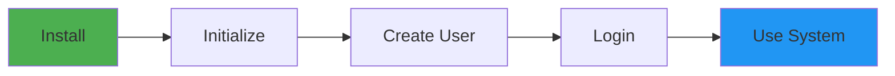

# Visual System Guide

## Quick Start Flow



## System Components

```
╔═══════════════════════════════════════════════════════════════╗
║                      UNIFIED SYSTEM                          ║
╠═══════════════════════════════════════════════════════════════╣
║                                                               ║
║  ┌─────────────┐  ┌─────────────┐  ┌─────────────┐         ║
║  │    AUTH     │  │   TOKENS    │  │    DEFI     │         ║
║  │             │  │             │  │             │         ║
║  │ • Register  │  │ • Create    │  │ • Pools     │         ║
║  │ • Login     │  │ • Transfer  │  │ • Swap      │         ║
║  │ • Sessions  │  │ • Balance   │  │ • Liquidity │         ║
║  └─────────────┘  └─────────────┘  └─────────────┘         ║
║        │                │                │                   ║
║        └────────────────┴────────────────┘                   ║
║                         │                                     ║
║              ┌──────────▼──────────┐                         ║
║              │   DATABASE LAYER    │                         ║
║              │    (SQLite3)        │                         ║
║              └─────────────────────┘                         ║
║                                                               ║
╚═══════════════════════════════════════════════════════════════╝
```

## User Journey

### 1️⃣ Registration & Login

```
START ──> [Register Account] ──> [Set Password] ──> [Login]
                                        │
                                        ▼
                                  [Get Session Token]
                                        │
                                        ▼
                                    [Access System]
```

### 2️⃣ Token Operations

```
[Check Balance] ◄──────────┐
       │                   │
       ▼                   │
[Need Tokens?] ──No────────┘
       │
      Yes
       ▼
[Receive/Buy Tokens] ──> [Transfer/Trade]
```

### 3️⃣ DeFi Operations

```
    ┌──────────────┐
    │  Your Tokens │
    └──────┬───────┘
           │
    ┌──────▼───────┐
    │   Choose:    │
    ├──────────────┤
    │ [A] Swap     │──────> Exchange tokens at market rate
    │ [B] Provide  │──────> Add liquidity, earn fees
    │     Liquidity │
    └──────────────┘
```

## Token Swap Visualization

```
Before Swap:
┌─────────────┐          ┌─────────────┐
│  You Have:  │          │    Pool     │
│             │          │             │
│  100 ETH    │          │ 1000 ETH    │
│    0 USDC   │          │ 2000000 USDC│
└─────────────┘          └─────────────┘

        Swap 10 ETH for USDC
               │
               ▼

After Swap:
┌─────────────┐          ┌─────────────┐
│  You Have:  │          │    Pool     │
│             │          │             │
│   90 ETH    │          │ 1010 ETH    │
│ 19,802 USDC │          │ 1980198 USDC│
└─────────────┘          └─────────────┘
```

## Liquidity Provision

```
Your Contribution:
┌──────────────┐
│  10 ETH  +   │
│  20,000 USDC │
└──────┬───────┘
       │
       ▼
  ┌─────────┐
  │  POOL   │
  │ ETH/USDC│
  └────┬────┘
       │
       ▼
┌──────────────┐
│ You Receive: │
│              │
│ 447.21 LP    │
│   Tokens     │
└──────────────┘
```

## AMM Formula Explained

```
Constant Product Formula: X × Y = K

Example Pool:
━━━━━━━━━━━━━━━━━━━━━━
  ETH: 100    (X)
  USDC: 200,000 (Y)
  K = 20,000,000
━━━━━━━━━━━━━━━━━━━━━━

Price Calculation:
1 ETH = 200,000/100 = 2,000 USDC
```

## Security Model

```
🔐 Security Layers:

Level 1: Input Validation
    ↓ [Sanitize all inputs]
Level 2: Authentication  
    ↓ [Verify credentials]
Level 3: Authorization
    ↓ [Check permissions]
Level 4: Execution
    ↓ [Process request]
Level 5: Audit
    ↓ [Log all actions]
✅ Response
```

## System Health Dashboard

```
╔═══════════════════════════════════════╗
║         SYSTEM HEALTH                 ║
╠═══════════════════════════════════════╣
║                                       ║
║  CPU Usage:     ████░░░░░░  42%      ║
║  Memory:        ██████░░░░  65%      ║
║  Disk:          ███░░░░░░░  31%      ║
║                                       ║
║  Active Users:        127             ║
║  Transactions/min:    45              ║
║  Total Pools:         12              ║
║                                       ║
║  Status: ✅ HEALTHY                   ║
╚═══════════════════════════════════════╝
```

## Database Schema

```
┌─────────────┐     ┌─────────────┐
│   USERS     │────<│  SESSIONS   │
└──────┬──────┘     └─────────────┘
       │
       │ 1:N
       ▼
┌─────────────┐     ┌─────────────┐
│  BALANCES   │>────│   TOKENS    │
└─────────────┘     └─────────────┘
       │
       │ N:N
       ▼
┌─────────────┐     ┌─────────────┐
│TRANSACTIONS │     │    POOLS    │
└─────────────┘     └──────┬──────┘
                           │
                           ▼
                    ┌─────────────┐
                    │  LIQUIDITY  │
                    └─────────────┘
```

## Performance Metrics

```
Request Processing:
═══════════════════════════════════════
│ Parse Request      │ ▓░░░░░ 5ms
│ Auth Check         │ ▓▓░░░░ 12ms  
│ Database Query     │ ▓▓▓░░░ 23ms
│ Business Logic     │ ▓▓▓▓░░ 31ms
│ Response Format    │ ▓░░░░░ 4ms
═══════════════════════════════════════
Total: 75ms
```

## Error Handling Flow

```
     Request
        │
        ▼
   ┌─────────┐
   │Validate │──────[Invalid]──────> 400 Bad Request
   └────┬────┘
        │
        ▼
   ┌─────────┐
   │  Auth   │──────[Failed]──────> 401 Unauthorized
   └────┬────┘
        │
        ▼
   ┌─────────┐
   │ Process │──────[Error]──────> 500 Server Error
   └────┬────┘
        │
        ▼
   200 Success
```

## Token Economics

```
                Total Supply
                    │
    ┌───────────────┴───────────────┐
    │                               │
User Wallets                   Liquidity Pools
    70%                            30%
    │                              │
    ├── Active: 45%                ├── ETH/USDC: 15%
    ├── Holding: 20%               ├── QXC/USDC: 10%
    └── Locked: 5%                 └── ETH/QXC: 5%
```

## Deployment Options

```
Option 1: Local Development
╔════════════════╗
║   localhost    ║
║   Python 3.8+  ║
║   SQLite3      ║
╚════════════════╝

Option 2: Docker Container
╔════════════════╗
║  Docker Image  ║
║  ┌──────────┐  ║
║  │   App    │  ║
║  │    +     │  ║
║  │    DB    │  ║
║  └──────────┘  ║
╚════════════════╝

Option 3: Cloud Deployment
╔════════════════╗
║   Cloud VPS    ║
║  ┌──────────┐  ║
║  │  Nginx   │  ║
║  │    ↓     │  ║
║  │   App    │  ║
║  │    ↓     │  ║
║  │ Database │  ║
║  └──────────┘  ║
╚════════════════╝
```

## API Response Format

```json
Success Response:
{
  "success": true,
  "data": {
    // Response data
  },
  "timestamp": "2024-01-01T00:00:00Z"
}

Error Response:
{
  "success": false,
  "error": {
    "code": "ERROR_CODE",
    "message": "Human readable message"
  },
  "timestamp": "2024-01-01T00:00:00Z"
}
```

## Getting Started Commands

```bash
# 1. Install Dependencies
pip install -r requirements.txt

# 2. Run System
python system.py

# 3. Expected Output:
============================================================
UNIFIED SYSTEM DEMONSTRATION
============================================================

1. Creating demo user...
   ✓ User created (ID: 1)

2. Authenticating user...
   ✓ Session created: abc123...

3. Minting tokens...
   ✓ 10,000 USDC minted
   ✓ 10 ETH minted

4. Adding liquidity to ETH/USDC pool...
   ✓ Liquidity added, received 223.6068 LP tokens

5. Swapping 1 ETH for USDC...
   ✓ Received 1980.20 USDC

6. Dashboard Data:
   - Total Users: 1
   - Total Transactions: 2
   - Active Tokens: USDC, ETH, QXC
   - Active Pools: ETH-USDC, QXC-USDC, ETH-QXC

============================================================
DEMONSTRATION COMPLETE
============================================================
```